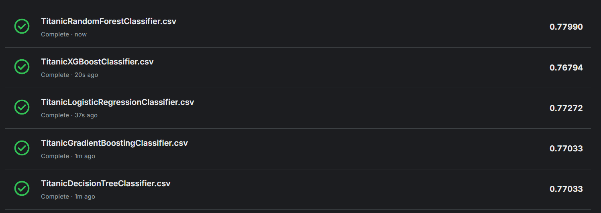

# Titanic Survival Prediction

Machine-learning project for the [Kaggle Titanic competition](https://www.kaggle.com/competitions/titanic). It compares five classification models and creates passenger-survival predictions for Kaggle submission.

## Project highlights

- Trains Logistic Regression, Decision Tree, Random Forest, Gradient Boosting, and XGBoost classifiers.
- Preprocesses missing values and categorical features with scikit-learn pipelines.
- Evaluates models using an 80/20 training/validation split and 5-fold cross-validation.
- Saves Kaggle submission CSVs and JSON evaluation summaries.
- Builds an HTML report to compare the saved model results.

## Results

Validation results below are from the saved evaluation summaries. Kaggle public scores are transcribed from the included submission screenshot and may change if submissions are re-evaluated.

| Model | 5-fold CV accuracy | Validation accuracy | Validation F1 | Kaggle public score |
|---|---:|---:|---:|---:|
| XGBoost | 83.71% ± 1.71 | **84.92%** | 0.784 | 0.76794 |
| Gradient Boosting | 83.28% ± 1.99 | 84.36% | 0.774 | 0.77033 |
| Random Forest | 82.72% ± 3.04 | 83.24% | 0.754 | **0.77990** |
| Decision Tree | 82.16% ± 2.38 | 81.56% | 0.740 | 0.77033 |
| Logistic Regression | 80.06% ± 2.37 | 81.01% | 0.750 | 0.77272 |

The best validation accuracy in the saved results is from XGBoost. The highest public Kaggle score shown in the screenshot is from Random Forest; these scores use different evaluation data and should not be compared directly.

## Screenshots

### Model comparison report

<p align="center">
  
</p>

<details>
  <summary>More report views</summary>

  <p align="center">
    
  </p>
  <p align="center">
    
  </p>
  <p align="center">
    
  </p>
</details>

### Kaggle submissions

<p align="center">
  
</p>

## Project structure

```text
.
├── data/
│   ├── train.csv
│   ├── test.csv
│   └── gender_submission.csv
├── images/
│   └── project and Kaggle screenshots
├── notebooks/
│   ├── DecisionTreeClassifier.py
│   ├── RandomForestClassifier.py
│   ├── logisticregressor.py
│   ├── gradientboostingclassifier.py
│   ├── xgboostclassification.py
│   ├── interface.py
│   ├── model_comparison.html
│   ├── Titanic*Classifier.csv
│   └── results/
│       └── model evaluation JSON files
└── README.md
```


### Requirements

- Python 3
- pandas
- scikit-learn
- XGBoost


## Data and features

The project uses the Kaggle Titanic competition files in `data/`. The classifiers use the following passenger features:

- Passenger class (`Pclass`)
- Sex
- Age
- Number of siblings/spouses aboard (`SibSp`)
- Number of parents/children aboard (`Parch`)
- Fare
- Port of embarkation (`Embarked`)

Missing numerical values are filled with the median, and missing categorical values with the most frequent value. Categorical features are one-hot encoded; Logistic Regression additionally standardizes numerical features. The target is `Survived` (`0` = did not survive, `1` = survived).


